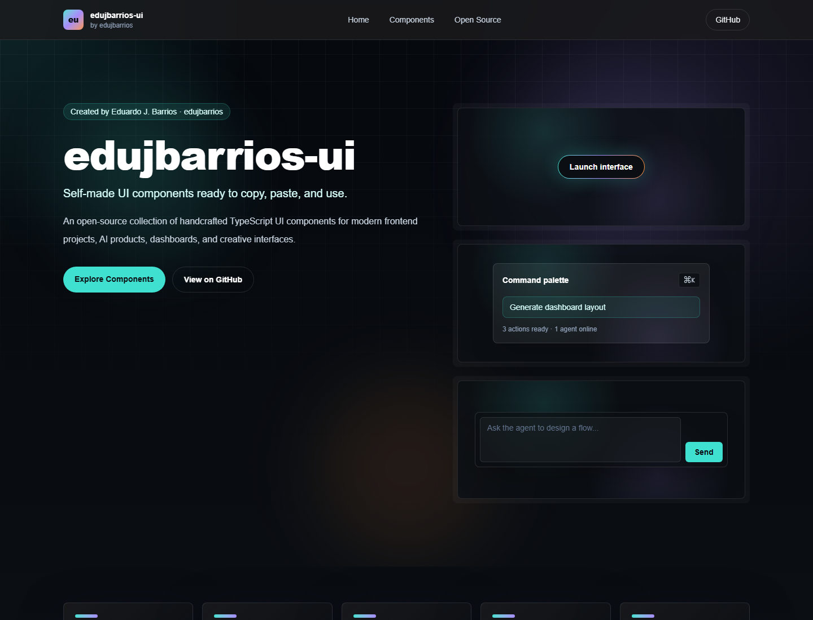

# edujbarrios-ui

Self-made React + TypeScript UI components ready to copy, paste, recolor, and use.

`edujbarrios-ui` is an open-source component gallery by Eduardo J. Barrios for AI products, dashboards, creative tools, and modern frontend projects.



## What You Get

- Dark-mode component gallery
- Live previews and detail pages
- Search and category filters
- Copy-to-clipboard source snippets
- Color roller previews and copy control for custom accent colors
- Local typed registry, no backend required

## Tech Stack

Next.js App Router, React, TypeScript, Tailwind CSS, and local TypeScript data.

## Run Locally

```bash
npm install
npm run dev
```

Open `http://localhost:3000`.

## Scripts

```bash
npm run dev
npm run lint
npm run build
```

## Add A Component

1. Add the component in `components/ui`.
2. Add its copyable source to `data/component-code.ts`.
3. Register metadata in `lib/components.ts`.
4. Register the preview in `components/component-preview.tsx`.
5. Run `npm run lint` and `npm run build`.

## Links

- GitHub: <https://github.com/edujbarrios/edujbarrios-ui>
- Live site: <https://edujbarrios-ui.vercel.app>

## License

Mozilla Public License 2.0. See [LICENSE](./LICENSE).

Built by Eduardo J. Barrios / `edujbarrios`.
